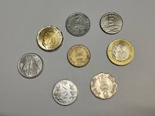
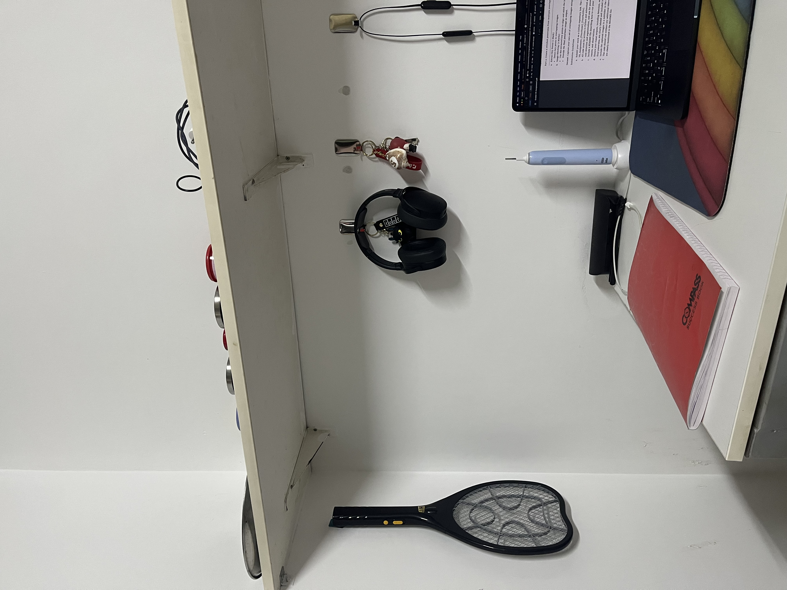
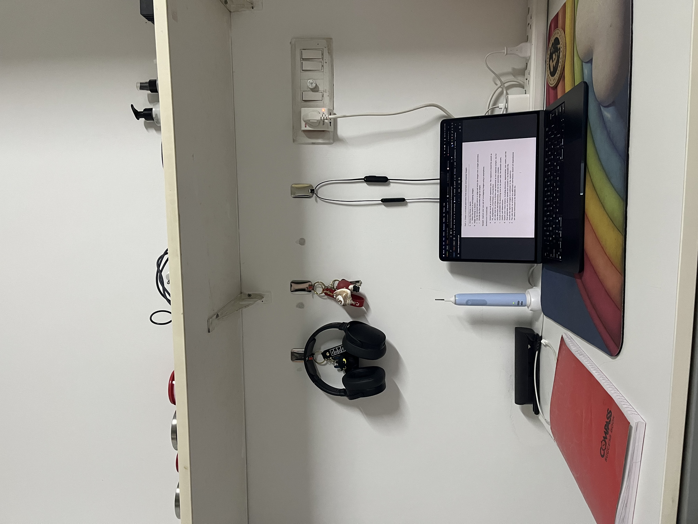
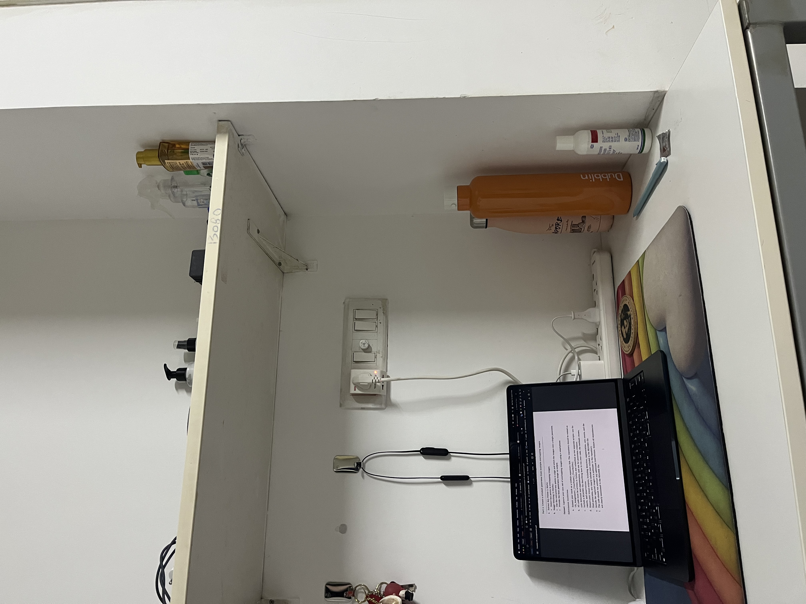
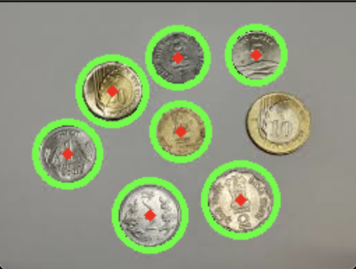
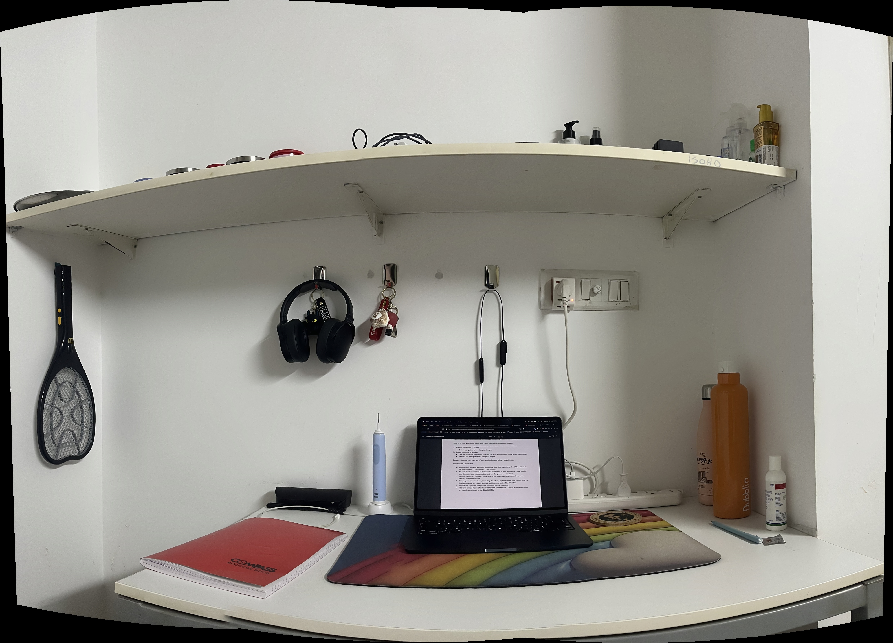

# VR Assignment 1: Coin Detection and Panorama Creation

## Table of Contents

- [Overview](#overview)
- [Requirements](#requirements)
- [Installation](#installation)
- [How to Run](#how-to-run)
  - [Coin Detection](#coin-detection)
  - [Panorama Creation](#panorama-creation)
- [Explanation of Code](#explanation-of-code)
  - [Coin Detection](#coin-detection-explanation)
  - [Panorama Creation](#panorama-creation-explanation)
- [Sample Outputs](#sample-outputs)
- [Observations](#observations)
- [Dependencies](#dependencies)
- [Conclusion](#conclusion)

---

## Overview

This project consists of two main tasks:

1. **Coin Detection:** Identifying and segmenting coins from an image using image processing techniques.
2. **Panorama Creation:** Stitching multiple images together to form a seamless panoramic view.

Both tasks are implemented in Python using OpenCV and NumPy.

---

## Requirements

Ensure that the following dependencies are installed:

- Python 3.x
- OpenCV (`cv2`)
- NumPy

---

## Installation

To set up the environment, install the required packages:

```sh
pip install opencv-python numpy
```

If using Conda:

```sh
conda install -c conda-forge opencv numpy
```

---

## How to Run

### Coin Detection

Run the following command:

```sh
python coinDetection.py
```

The script will process the image, detect coins, and display the results.

### Panorama Creation

Run the following command:

```sh
python panoramaFormation.py
```

This will stitch the images together and display the final panorama.

---

## Explanation of Code

### Coin Detection Explanation

1. **Loading the Image**: The image is loaded in grayscale mode for processing.
2. **Gaussian Blur**: Applied to reduce noise and enhance object edges.
3. **Adaptive Thresholding**: Used to differentiate coins from the background dynamically.
4. **Morphological Operations**: Closing operation fills small gaps to improve contour detection.
5. **Contour Detection**: Extracts potential coin-like shapes.
6. **Circularity Check**: Filters out non-circular objects.
7. **Drawing Circles**: Highlights detected coins with green circles and centers with red dots.
8. **Displaying Results**: Outputs the number of detected coins and the final image.

### Panorama Creation Explanation

1. **Loading Images**: Reads the input images.
2. **Stitching Process**: Uses OpenCV's `cv2.Stitcher_create()` to stitch images together.
3. **Handling Errors**: Checks if stitching was successful.
4. **Saving and Displaying**: Outputs the final panorama image.

---
## Sample Inputs

### Coin Detection Output

This picture of 8 coins was taken from the internet.



### Panorama Creation Output

These 3 pictures of my work environment were taken using my phone's camera.





## Sample Outputs

### Coin Detection Output

The detected coins are highlighted with green circles, and their centers are marked with red dots. Only 7 coins have been detected out of the total 8 coins in the image, various methods were tried to improve the detection accuracy, but so far all of them have been unsuccesful. These have been mentioned in the Observations section.



### Panorama Creation Output

The final panorama image seamlessly combines multiple input images.


---

## Observations

- **Coin Detection**: Works well when coins are distinct and well-lit. Small objects or touching coins may reduce accuracy. This was checked using pictures of other coins which have been included in the images/coins/other folder.
- **Problems faced in coin detection**: 
- **Panorama Creation**: Success depends on image overlap and alignment. Large differences in lighting can cause artifacts. This causes an unsatisfactory panorama to be formed. 

---

## Dependencies

- Python 3.x
- OpenCV (`cv2`)
- NumPy

---

## Conclusion

This project successfully demonstrates fundamental image processing techniques for object detection and panorama stitching using OpenCV. Enhancements like deep learning-based detection or feature matching could further improve accuracy.

